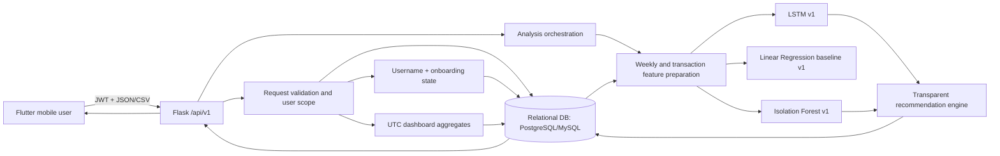

# System Architecture

## Boundaries

- Flutter contains no model-training logic.
- Flask routes validate and delegate; machine-learning logic lives in services.
- Model artefacts load once when Flask starts.
- API requests perform inference only and never retrain.
- SQLAlchemy repositories enforce user ownership.
- Alembic manages the PostgreSQL/MySQL schema.
- The LSTM is the main forecast; Linear Regression remains an internal
  comparison.
- Isolation Forest produces unusual-spending review prompts, not fraud labels.

## Stored entities

Users, transactions, budgets, analysis runs, forecasts, anomaly alerts,
recommendations, and model versions.

Frozen V2 artifacts are outside this production path. Their separate adapter,
shadow storage, feature flags and monitoring remain blocked until the complete
feature contract and anomaly percentile reference artifact are packaged. See
`docs/model_integration_readiness_v2.md`.
